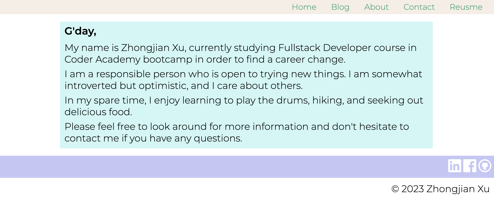
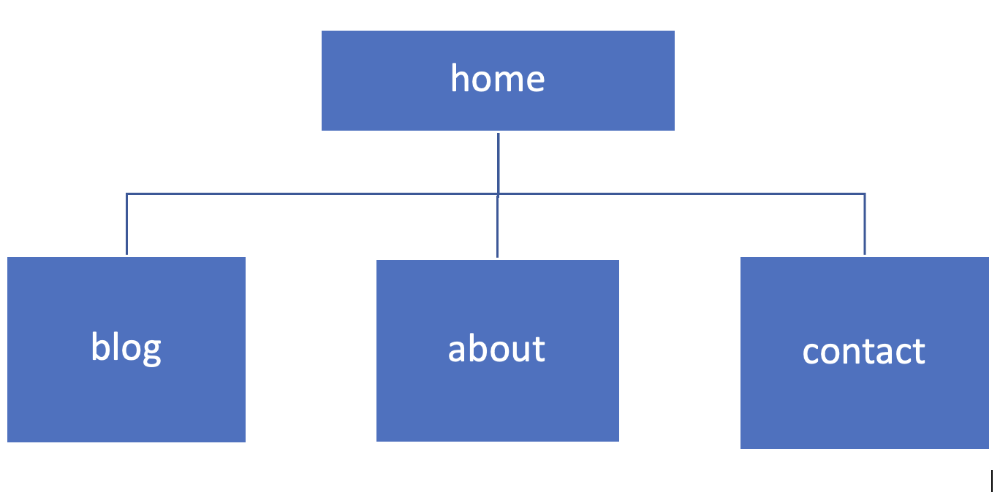

# ZhongjianXu_T1A2
prestation url:https://youtu.be/m_83G3tjAGE
website url: https://zhongjianxu.vercel.app/
Github repo: https://github.com/xzj66778899/ZhongjianXu_T1A2

This is a potfolio website deployed on Vercel that provides my personal information about my skills, interests, knowledge and capabilities. By using HTML and CSS technology stacks, it consists of 4 pages linked to each other with reponsive styles to mobile, tablet and desktop display.
The target audiences are the employers looking for IT professionals.

Here are the sitemap and screenshots of the website.

